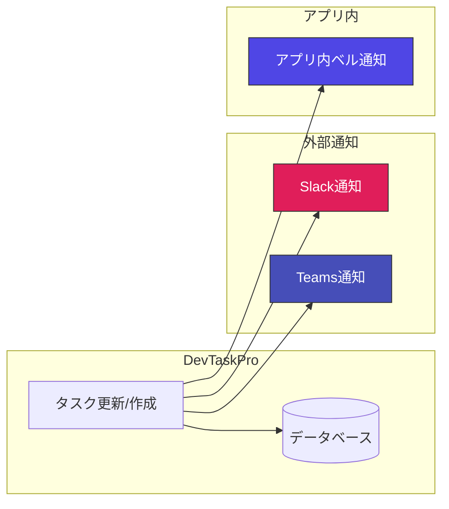

# DevTaskPro ロードマップ提案 (Post-MVPアイデア集)

MVP（最低限の機能要件）の実装と疎通が完了したため、プロダクトとしての価値を高め、より実務に適した製品へとアップグレードするための機能拡張アイデアをまとめました。

---

## 1. コアタスク管理の高度化

現在のタスク機能に加え、複雑な開発プロジェクトのワークフローに対応するためのアイデアです。

| 機能名 | 概要 | 導入メリット | 難易度 |
| :--- | :--- | :--- | :--- |
| **子タスク（チェックリスト）** | 1つのタスクをさらに小さな作業単位に分割してチェックできるようにする | 大きなタスクの分割と、細かな進捗率の正確な把握 | 低 |
| **タスクの依存関係** | 「タスクAが完了するまで、タスクBに着手できない」といった前後関係の定義 | ガントチャート上での先行・後続タスクのライン可視化 | 中 |
| **添付ファイル・画像保存** | 設計書PDFや画面キャプチャ画像をタスクにドラッグ＆ドロップで添付可能にする | タスクに関するエビデンスや資料の一元化 | 中 |

---

## 2. スケジュール & リソース管理の本格化

ガントチャートとアサイン状況画面を結合し、PMが意思決定を行える「管理ツール」として強力にするための機能です。

### 📅 ガントチャートのインタラクティブ化
- **ドラッグ＆ドロップ操作:**
  ガントチャート上のバーの端をドラッグして期間を延ばしたり、バー全体を左右にスライドさせて予定日（`plannedStartDate` / `plannedEndDate`）を直感的に変更・自動保存する機能。
- **クリティカルパスの自動検出:**
  依存関係に基づき、遅延するとプロジェクト全体が遅れるタスク群を赤線で強調表示。

### ⏱ タイムトラッキング（実績時間）の統合
- **日々のワークログ機能:**
  メンバーが「何月何日にどのタスクに何時間使ったか」を記録するテーブルを追加し、実績工数を集計。
- **期間指定の稼働負荷分析:**
  「今月」や「来週」など指定した期間のみの合計アサイン工数を算出し、特定の週に負荷が集中する状況を防ぐ。

---

## 3. コラボレーション & 通知

チーム開発において、コミュニケーションロスを減らすための連携機能です。

- **コメント・アクティビティログ:**
  各タスクの詳細画面でコメントのやり取りができ、変更履歴（ステータスの推移や期限変更など）がタイムライン形式で記録される機能。
- **チャットツール連携 (Slack/Teams):**
  Webhookを利用し、タスクが起票されたりステータスが「レビュー中」や「完了」になったときに自動でチャンネルに通知を送る機能。

---

## 4. セキュリティ & 認証（マルチユーザー対応）

現在はデモとしてモックで動作している部分を、本番環境で安全に動作させるための基盤構築です。

- **HttpOnly Cookie 方式による JWT 認証基盤 (フェーズ1 実装完了):**
  NestJSとPostgreSQLを使用したJWT (JSON Web Token) によるセキュアなログイン認証・Cookie発行・保護ルーティング（`/login` / `ProtectedRoute`）の構築。`access_token` (HttpOnly, maxAge: 8h) と `is_logged_in` (JS可, maxAge: 8h) のデュアルCookie構造により、即時フロントログアウト guard を実現。
- [ ] **全域JWT保護とRefresh Token導入 (フェーズ2 ロードマップ計画):**
  - **バックエンド:** Access Token の寿命を `15分` に短縮。長寿命の Refresh Token (HttpOnly Cookie) を発行し、DB/Redis でホワイトリスト管理および Revoke（失効）機能を実装。全コントローラーへ `@UseGuards(JwtAuthGuard)` を適用し、`req.user.userId` を動的セット。
  - **フロントエンド:** 401 Unauthorized 検知時の自動リトライ機能 (Axios/Fetch インターセプターによる `/api/auth/refresh` の自動呼び出しとトークン再取得キューイング・排他制御)。
- [ ] **Auth以外の既存コントローラー（TaskController, ProjectController, UserController 等）に対する全域JWT保護:**
  Auth 以外の全コントローラーへ `@UseGuards(JwtAuthGuard)` を付与し、未ログインアクセスの遮断と、リクエストの `req.user.userId` から起票者（`createdBy`）や変更者（`changedBy`）への自動セットを行う。
- [ ] **ユーザー登録 & プロフィール管理:**
  新規アカウント作成機能と、アバター画像や最大稼働時間（デフォルト40時間）を設定する画面の実装。
- [ ] **テナント・プロジェクト権限管理 (RBAC):**
  メンバーによって「読み取り専用」「編集可能」などの権限を制御する機能。
- [ ] **組織（チーム）マスタの作成とヘッダー表示の動的連携:**
  `organizations` テーブルの新規作成と `users` テーブルへの `organization_id` リレーション構築。`GET /api/auth/me` から `organizationName` を返却し、[layout.tsx](file:///c:/Users/81904/work_space/dev-task-management-app/apps/frontend/src/components/layout.tsx#L125) の固定値「開発チームA」を動的表示へと切り替える。
- [ ] **Playwright E2E テストの高速化 (`storageState` / Global Setup 移行):**
  毎テストの `beforeEach` での UI ログイン処理を廃止し、Global Setup で事前に Cookie セッション (`storageState.json`) を 1 度だけ作成・保存して使い回す方式へリファクタリング（テスト実行時間の高速化）。

---

## 5. レビューに基づく次回改善・対応方針 (1〜5)

フィードバックに基づき、次回開発時の設計方針を策定しました。

### ① 変更履歴の日本語化と言語の網羅 (見積もり工数、プロジェクト、カテゴリ、チケット等)
* **課題:** 
  タスクの `estimatedHours`（見積もり時間）や `projectId`（プロジェクトID）などの変更時、タイムラインに日本語で具体的な内容が表示されない。
* **対応設計:**
  1. **バックエンド (`UpdateTaskUseCase.ts`):** `serializeTaskState` において `estimatedHours` だけでなく、すべての監視対象値（`projectId`, `categoryId`, `ticketId`）を確実にシリアライズします。
  2. **フロントエンド (`task-list.tsx`):**
     * 翻訳関数 `translateKey` に `'projectId' (プロジェクト)`, `'categoryId' (カテゴリ)`, `'ticketId' (チケットID)` を追加。
     * 変換関数 `translateValue` において、`projectId` および `categoryId` が持つUUIDを、それぞれフロントが持つ `projects` マスタや `mockCategories` から名称検索して `「DevTaskApp」` のような表示名に動的変換します。

### ② 新規起票時の履歴の自動保存
* **課題:** 
  最初のタスク登録アクション自体が履歴タイムラインに表示されない。
* **対応設計:**
  * **バックエンド (`CreateTaskUseCase.ts`):** タスク保存に成功した直後に、`TaskHistoryRepository` を呼び出して `actionType: 'CREATE'` のログを追加します。
  * この際、変更前データは存在しないため `beforePayload: null` とします。
  * **フロントエンド (`task-list.tsx`):** `beforePayload === null` である履歴レコードを検知した場合、変更の差分ループを行わず、**「[起票者名] がこのタスクを起票しました」** という一言メッセージを表示します。

### ③ ガントチャートにおける進捗率（％）の算出ロジック
* **設計確認:**
  * 現状のステータス連動（未着手: 0% / 進行中: 50% / レビュー中: 80% / 完了: 100%）による算出をベース（既定値）とします。
  * 今後、より微細な管理を行いたい場合、タスクモデルに `progressRate: number (0〜100)` カラムを追加し、タスク詳細モーダルから手動で「現在の本当のパーセンテージ」を設定できる機能を追加で検討します。

### ④ アサイン状況における「期間」を考慮した負荷（工数）算出
* **課題:** 
  現在のアサイン画面の合計時間は「アサインされている全タスクの単純合計」となっており、いつ消化されるものなのかという時間軸（負荷集中度合い）が考慮されていない。
* **対応設計:**
  * **期間絞り込み（フィルター）の追加:** 
    アサイン状況画面に「期間フィルター（今週 / 今月 /特定のスプリント等）」を配置します。
  * **負荷の計算ロジック:** 
    指定期間内に実施予定日（`plannedStartDate` 〜 `plannedEndDate`）が重なっているタスクだけを抽出します。
    さらに精度を高める場合は、タスクの稼働日数を算出し、指定期間内に占める稼働日数に按分（比例配分）して「この期間におけるアサイン工数」を計算するロジックを実装します。

### ⑤ Auth以外の既存コントローラーに対するJWT認証保護とユーザーID動的連携のインテグレーション時期
* **設計確認:**
  * **フェーズ1（完了）:** `AuthService`, `AuthController`, `JwtStrategy`, `HttpOnly Cookie` 発行基盤、`/login` 画面およびフロントエンドのセッション復元フローの実装。
  * **フェーズ2（次回対応）:** `Auth` 以外の全コントローラー（`TaskController`, `ProjectController`, `UserController` 等）へ `@UseGuards(JwtAuthGuard)` を付与し、API 全域の JWT 認証保護および起票者（`createdBy`）/ 変更者（`changedBy`）へ `req.user.userId` を動的セットする。

---

## 6. さらなる機能差別化案 (プロ仕様ロードマップ)

実務上のプロジェクト運営において、競合ツール（Trello、Spreadsheet等）や既存のチケットシステム（Redmine等）と強力に差別化するための「プロフェッショナル向け」の高度なアイデア集です。

### ① 見積もりと実績の「乖離分析（偏差アラート）」
* **概要:** 
  見積もり工数に対して実績工数が `120%` や `150%` を超過した瞬間に、タスクカードやガントバーに警告アラート（黄・赤）を出します。
* **メリット:** 
  完了時に「仕様変更」「技術的負債」「要件追加」といった原因タグを選択・記録させ、プロジェクト終了時に「どこで最も見積もりズレが発生したか」の統計データを可視化します。

### ② 実績ペースに基づく「予測完了日の自動算出」
* **概要:** 
  期日（デッドライン）と実際の消化ペースの乖離を予測します。
* **メリット:** 
  過去3〜5日間のワークログ（実績入力ペース）から逆算して、このままでは何日に完了するかをシステムが自動予測。予定日（ plannedEndDate ）をオーバーすると予測される場合は、PMへ事前にアラートを通知し、土壇場での遅延発覚を防ぎます。

### ③ 個人に合わせた「安全バッファ（個人係数）の自動可視化」
* **概要:** 
  「常にギリギリで見積もるメンバー」や「余裕を持たせるメンバー」など、人それぞれの癖をシステムが学習します。
* **メリット:** 
  過去の「見積もり vs 実績」の比率（係数）から、メンバー固有の予測係数（例: +20%）を割り出します。ガントチャート上に「予測されるリアルなバッファ期間（うっすらとした背景枠）」を重ねて表示し、PMのより正確な日程調整を支援します。

### ④ 開発者専用の「フォーカスモード（マイ・タスク）」
* **概要:** 
  PM向けの全体ガントやアサイン状況とは対称的に、開発者自身が「今日1日」に集中するための専用ダッシュボードです。
* **メリット:** 
  今日やるべきタスクだけがシンプルに表示され、詳細を開かずに1クリックでタイマーを開始・終了して実績工数を自動記録。開発者側でのワークログ入力を圧倒的に簡単にし、入力漏れを防ぎます。

### ⑤ カテゴリマスタAPIの作成と `mockCategories` / `mockProjects` の完全削除
* **概要:** 
  現在フロントエンド側で保持している `mockCategories`（マスタ）のバックエンドAPI化（`GET /api/categories`）を行います。
* **メリット:** 
  カテゴリ一覧もプロジェクトやユーザーと同様にデータベースから動的取得できるようにし、`task-list.tsx` 内のすべてのモック定数フォールバックを完全に排除してコードをクリーンに保ちます。

---

## 7. UX・リソース計算の高度化課題 (後続フェーズ向けバックログ)

実運用に向けたUX調整および高度なスケジュール分析の課題集です。

### ① 数値入力フォーム（見積もり工数）の「0クリア」対応
* **内容:** 数値入力欄（`<input type="number">`）で `0` をバックスペースで消した際に、空文字としてクリアできるように状態管理（`editEstimate || ''`）を調整するUI改善。

### ② 祝日・稼働日数を考慮した精度向上カレンダー
* **内容:** 土日だけでなく、日本の祝日（ハッピーマンデー等）や月ごとの正確な平日営業日数を計算し、月間キャパシティ（例: 160hではなく実稼働日×8h）を動的算出する機能。

### ③ 全期間における「特定日のピーク過負荷 (1日8h超え)」検知
* **内容:** 月間の合計工数が適正範囲内であっても、複数タスクの期間が重なる特定の「火曜日」などに1日12時間以上の作業が集中するようなピーク過負荷を日単位で検知・警告するアドバンスド分析機能。

---

## 8. ロール定義 & ロール別視点ワークフローの設計マトリクス

多様な関係者がストレスなく利用できるよう、ロールごとの権限と専用ワークフロー（画面視点）を整理・拡張します。

| ロール名 | 日本語名 | 権限範囲 | 主なワークフロー・視点画面 |
| :--- | :--- | :--- | :--- |
| **`ADMINISTRATOR`** | システム管理者 | 全権限（ユーザー追加/削除、ロール変更、プロジェクト削除） | システム管理・ユーザー管理画面 |
| **`ENGINEERING_MANAGER`** | エンジニアリングマネージャー (EM) | チーム/タスク/リソース管理（ユーザー管理権限を除く全権限） | ガントチャート、アサイン状況(キャパシティ分析)、変更履歴 |
| **`ENGINEER`** | 開発エンジニア | 自身のアサインタスクの更新、工数(ワークログ)記録、コメント投稿 | **「マイ・フォーカスダッシュボード」** (本日の着手タスク、タイマー機能) **「マイ・ガントチャート / セルフキャパシティ分析」** (自身のスケジュールタイムライン、個人の負荷レベル適正チェック) |
| **`BUSINESS`** | ビジネスサイド / PO | 要件タスクの起票、進捗確認、優先度リクエスト | **「ビジネス進捗ビュー」** (リリース/機能単位のマクロ進捗) |

### 💡 各視点ワークフローの導入ステップ
1. **EM視点 (実装済み):** 全体ガントチャート、全体アサイン負荷分析、監査ログなどのマクロ管理ビュー。
2. **エンジニア視点 (セルフマネジメント強化):**
   * **マイ・ガントチャート (フィルター機能):** ガントチャート画面やアサイン画面で「自分のタスクのみ」ボタンを1クリックし、自身の担当スケジュールのタイムラインを一覧視覚化。
   * **セルフキャパシティ分析:** 自身のアサイン工数が「適正」か「過負荷」かを自分で確認し、早めにEMへ相談できるセルフチェック機能。
   * **マイ・フォーカス:** 今日の作業に集中し、ワンタップで実績時間を記録できるデイリービュー。
3. **ビジネスサイド視点:** 開発の技術的詳細を隠し、企画・リリース単位で「いつリリースされるか」が直感的にわかるロードマップビュー。
