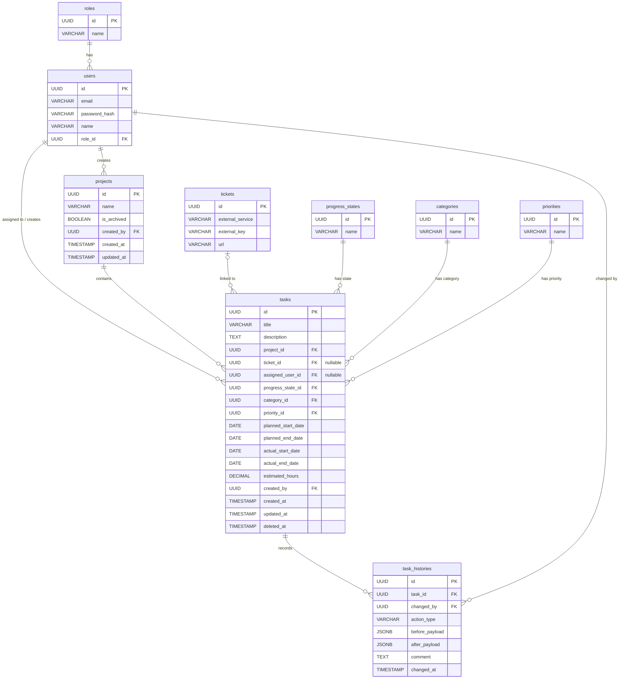
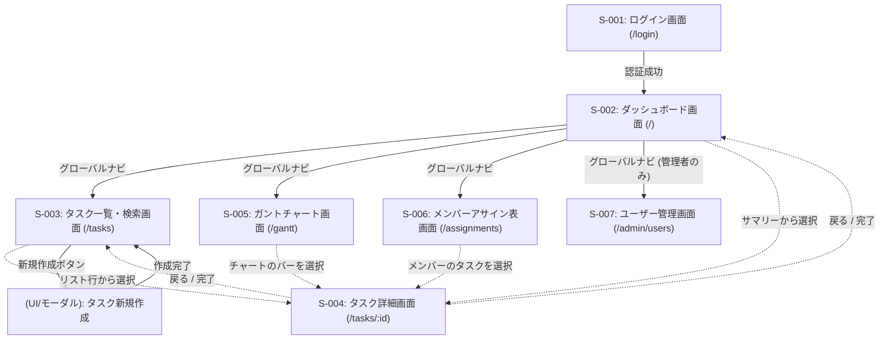

# システム基本設計書：DevTaskManagementApp

## 1. 開発の背景と目的
現在、多くの開発現場において、タスクがExcel、Backlog、Jiraなどに散在し、メンバーの正確なアサイン状況や負荷の可視化が課題となっています。
本システムは、Jira/Backlog等の「外部チケット」と紐づいた柔軟なタスク管理を提供し、ビジネスサイドからの開発依頼、メンバーのアサイン状況の可視化（ガントチャート等）を一元化することで、チームの生産性を最大化することを目的とします。

## 2. 技術スタック & アーキテクチャ方針
* **フロントエンド:** React (TypeScript), SPA, Tailwind CSS (UI)
* **バックエンド:** NestJS (TypeScript)
* **データベース:** PostgreSQL (想定)
* **設計手法 / プラクティス:**
    * **ドメイン駆動設計 (DDD):** オニオンアーキテクチャの採用。ドメインロジックを永続化層（DB）やWebフレームワークから完全に分離し、堅牢なビジネスルールを構築。
    * **テスト駆動開発 (TDD):** ドメイン層・ユースケース層（サービス層）を中心にUnit Test（Jest）を徹底。API層はE2Eテストを実施。
    * **RESTful API:** リソース指向で直感的なエンドポイント設計。

---

## 3. データベース論理設計



### 3.1. テーブル定義一覧

#### 1. users (ユーザー)
| カラム名 | 型 | 制約 | 説明 |
| :--- | :--- | :--- | :--- |
| `id` | UUID | PK | ユーザーの一意識別子 |
| `email` | VARCHAR | UNIQUE, NOT NULL | ログイン用メールアドレス |
| `password_hash` | VARCHAR | NOT NULL | ハッシュ化されたパスワード |
| `name` | VARCHAR | NOT NULL | 表示名 |
| `role_id` | UUID | FK, NOT NULL | 権限（`roles.id`） |

#### 2. roles (権限ロール)
| カラム名 | 型 | 制約 | 説明 |
| :--- | :--- | :--- | :--- |
| `id` | UUID | PK | ロールの一意識別子 |
| `name` | VARCHAR | NOT NULL | ロール名（Administrator / Engineer / Business） |

#### 3. projects (プロジェクト)
| カラム名 | 型 | 制約 | 説明 |
| :--- | :--- | :--- | :--- |
| `id` | UUID | PK | プロジェクトの一意識別子 |
| `name` | VARCHAR | NOT NULL | プロジェクト名 |
| `is_archived` | BOOLEAN | DEFAULT FALSE | アーカイブフラグ（不要なプロジェクトを隠す用） |
| `created_by` | UUID | FK, NOT NULL | 作成者（`users.id`） |
| `created_at` | TIMESTAMP| NOT NULL | 作成日時 |
| `updated_at` | TIMESTAMP| NOT NULL | 最終更新日時 |

#### 4. tasks (タスク)
| カラム名 | 型 | 制約 | 説明 |
| :--- | :--- | :--- | :--- |
| `id` | UUID | PK | タスクの一意識別子 |
| `title` | VARCHAR | NOT NULL | タスクタイトル |
| `description` | TEXT | | タスク詳細説明 |
| `project_id` | UUID | FK, NOT NULL | 所属プロジェクト（`projects.id`） |
| `ticket_id` | UUID | FK, NULL可 | 外部チケット（`tickets.id`） |
| `assigned_user_id` | UUID | FK, NULL可 | 担当エンジニア（`users.id`） |
| `progress_state_id`| UUID | FK, NOT NULL | 進捗状況（`progress_states.id`） |
| `category_id` | UUID | FK, NOT NULL | カテゴリー（`categories.id`） |
| `priority_id` | UUID | FK, NOT NULL | 優先順位（`priorities.id`） |
| `planned_start_date`| DATE | | 計画開始日（ガントチャート用） |
| `planned_end_date`  | DATE | | 計画終了日（ガントチャート用） |
| `actual_start_date` | DATE | | 実績開始日 |
| `actual_end_date`   | DATE | | 実績終了日 |
| `estimated_hours` | DECIMAL | | 見積もり工数（マネージャーの負荷可視化用） |
| `created_by` | UUID | FK, NOT NULL | 起票者・依頼者（`users.id`） |
| `created_at` | TIMESTAMP| NOT NULL | 作成日時 |
| `updated_at` | TIMESTAMP| NOT NULL | 最終更新日時 |
| `deleted_at` | TIMESTAMP| | 論理削除用日時 |

#### 5. tickets (外部チケット連携)
| カラム名 | 型 | 制約 | 説明 |
| :--- | :--- | :--- | :--- |
| `id` | UUID | PK | チケットの一意識別子 |
| `external_service` | VARCHAR | NOT NULL | 外部サービス名（Backlog / Jira / GitHub 等） |
| `external_key` | VARCHAR | NOT NULL | チケットキー（例: `PROJ-123`） |
| `url` | VARCHAR | | 外部チケットへの直接リンクURL |

#### 6. task_histories (タスク変更履歴)
| カラム名 | 型 | 制約 | 説明 |
| :--- | :--- | :--- | :--- |
| `id` | UUID | PK | 履歴の一意識別子 |
| `task_id` | UUID | FK, NOT NULL | 変更対象のタスク（`tasks.id`） |
| `changed_by` | UUID | FK, NOT NULL | 変更操作を行ったユーザー（`users.id`） |
| `action_type` | VARCHAR | NOT NULL | 操作種別（`CREATE` / `UPDATE` / `DELETE` / `ASSIGN`） |
| `before_payload` | JSONB | | 変更前のタスク状態のスナップショット（差分計算用） |
| `after_payload` | JSONB | | 変更後のタスク状態のスナップショット（差分計算用） |
| `comment` | TEXT | | 変更時のコメント（任意） |
| `changed_at` | TIMESTAMP| NOT NULL | 変更日時 |

#### 7. マスタテーブル群 (`progress_states`, `categories`, `priorities`)
* それぞれ `id` (PK), `name` (NOT NULL) カラムを持ち、ステータス（未着手/進行中...）、カテゴリ（フロント/バックエンド...）、優先度（高/中/低）を管理。

### 3.2. インデックス設計
検索やソート条件に基づくパフォーマンス最適化のため、以下のインデックスを設けます。

| 対象テーブル | カラム構成 | 目的・用途 |
| :--- | :--- | :--- |
| `users` | `email` | ログイン時の高速なユーザー検索 |
| `tasks` | `project_id` | プロジェクトごとのタスク一覧取得 |
| `tasks` | `assigned_user_id` | 担当者ごとのタスク絞り込み |
| `tasks` | `progress_state_id` | ステータス（未着手・進行中など）による絞り込み |
| `tasks` | `planned_end_date` | 期日順でのソート表示、ガントチャート描画 |
| `task_histories` | `task_id`, `changed_at` | 特定タスクの変更履歴を時系列で高速取得 |

---

## 4. 機能要件 (機能一覧)

本システムが提供する主要な機能一覧です。

| 機能ID | 機能グループ | 機能名 | 詳細 | ターゲットロール |
| :--- | :--- | :--- | :--- | :--- |
| F-001 | 認証 | ログイン・ログアウト | JWTを用いたセキュアな認証 | 全ロール |
| F-002 | タスク管理 | タスク一覧取得 | プロジェクトや担当者、ステータスに応じたタスクの絞り込み表示 | 全ロール |
| F-003 | タスク管理 | タスク作成 | ビジネスサイドからの依頼や、開発タスクの起票 | 全ロール |
| F-004 | タスク管理 | タスク詳細表示・編集 | 担当者アサイン、ステータス変更、期日設定などの更新 | 全ロール |
| F-005 | タスク管理 | タスク変更履歴表示 | タスク詳細画面における「誰がいつ何を変更したか」の時系列表示 | 全ロール |
| F-006 | 可視化 | メンバーアサイン表表示 | 各メンバーが抱えるタスク量、アサイン状況の可視化 | 全ロール |
| F-007 | 可視化 | ガントチャート表示 | スケジュールと進捗状況をタイムライン形式で俯瞰 | 全ロール |
| F-008 | ユーザー管理 | ユーザー登録・更新・削除 | システムを利用するメンバーのアカウント・権限管理 | 管理者 |
| F-009 | マスタ管理 | ステータス・カテゴリ管理 | ステータスやカテゴリ等のマスタデータ管理 | 管理者 |
| F-010 | プロジェクト管理 | プロジェクト作成・アーカイブ | 現場のスピード感を保つため全ロールで作成可能とする（表記揺れ防止のサジェストを導入） | 全ロール |

### 4.1. 抽出（フィルタリング）＆ソート仕様
一覧性を高め、実用的なタスク管理を実現するため、フロントエンド・バックエンド双方で以下のクエリパラメータに対応します。

#### 抽出（フィルター）条件
1.  **プロジェクト:** プロジェクトIDによる絞り込み（複数選択可）
2.  **担当者:** アサインされているユーザーによる絞り込み（「未割り当て」「自分のみ」「特定のメンバー」）
3.  **ステータス / 優先度:** 各マスタIDに基づく絞り込み
4.  **キーワード検索:** タスクの `title`、`description`、および外部チケットの `external_key` に対する部分一致（あいまい）検索

#### ソート条件
1.  **優先度順:** `high -> medium -> low` またはその逆
2.  **期日順:** `planned_end_date` の昇順（期限が近い順） / 降順
3.  **更新日・作成日順:** `updated_at` または `created_at` の降順（最新順） / 昇順

---

## 5. APIインターフェース設計 (API一覧)

フロントエンドとバックエンド間で通信を行うREST APIのエンドポイント一覧です。

| エンドポイントパス | HTTPメソッド | 機能 | 備考 |
| :--- | :--- | :--- | :--- |
| `/api/auth/login` | POST | ログイン | JWTトークンを発行 |
| `/api/users` | GET / POST | ユーザー一覧取得 / 作成 | 管理者用 |
| `/api/users/:id` | GET / PUT / DELETE | ユーザー詳細取得 / 更新 / 削除 | 管理者用 または自身の情報更新 |
| `/api/projects` | GET / POST | プロジェクト一覧取得 / 作成 | 全ロールアクセス可能 |
| `/api/projects/:id` | PUT / DELETE | プロジェクト更新（アーカイブ化など） / 削除 | |
| `/api/tasks` | GET | タスク一覧取得 | クエリパラメータでフィルタ＆ソートを指定 |
| `/api/tasks` | POST | タスク作成 | |
| `/api/tasks/:id` | GET | タスク詳細取得 | |
| `/api/tasks/:id` | PUT | タスク情報更新 | ステータス変更、担当者アサイン変更など |
| `/api/tasks/:id` | DELETE | タスク削除 | |
| `/api/tasks/:id/histories` | GET | タスク変更履歴取得 | タスク詳細画面のタイムライン表示用 |
| `/api/masters/:type` | GET | マスタ情報取得 | `categories`, `priorities`, `progress_states` などの一覧 |

---

## 6. フロントエンド設計 (画面一覧と画面遷移)

### 6.1. 画面一覧

| 画面ID | 画面名 | 役割・概要 | ルーティング (URLパス) |
| :--- | :--- | :--- | :--- |
| S-001 | ログイン画面 | メールアドレス・パスワードでの認証 | `/login` |
| S-002 | ダッシュボード画面 | 自分の担当タスク一覧、直近の期日のタスク、自分が依頼したタスク一覧（ビジネスサイド向け）をサマリー表示 | `/` |
| S-003 | タスク一覧・検索画面 | 条件を指定してタスクを検索し、リスト形式で表示 | `/tasks` |
| S-004 | タスク詳細画面 | 特定タスクの詳細情報、ステータス変更、タイムライン履歴表示 | `/tasks/:id` |
| S-005 | ガントチャート画面 | プロジェクトごとのタイムラインと進捗を可視化 | `/gantt` |
| S-006 | メンバーアサイン表画面 | メンバーごとの負荷状況（アサイン済みタスク）の可視化 | `/assignments` |
| S-007 | ユーザー管理画面 | 管理者向け。アカウント追加・権限付与・削除 | `/admin/users` |

### 6.2. 画面遷移



* **ログイン画面 (`/login`)**
  * 認証成功 -> **ダッシュボード画面 (`/`)**
* **ダッシュボード画面 (`/`)**
  * グローバルナビゲーションから各画面（タスク一覧、ガントチャート等）へ遷移
  * サマリー上のタスクをクリック -> **タスク詳細画面 (`/tasks/:id`)**
* **タスク一覧・検索画面 (`/tasks`)**
  * リスト行をクリック -> **タスク詳細画面 (`/tasks/:id`)**
  * 「新規作成」ボタン -> (モーダルまたは別画面でタスク作成 UI) -> 作成完了後、一覧更新
* **タスク詳細画面 (`/tasks/:id`)**
  * 編集完了 -> 現在の画面を更新
  * 「戻る」ボタン -> 元の一覧またはガントチャート等へ戻る
* **ガントチャート画面 (`/gantt`)**
  * バーをクリック -> **タスク詳細画面 (`/tasks/:id`)**
* **メンバーアサイン表画面 (`/assignments`)**
  * メンバーのタスクをクリック -> **タスク詳細画面 (`/tasks/:id`)**

### 6.3. 状態管理・データフェッチ方針
* **非同期通信・サーバー状態管理:** `SWR` または `React Query` を使用し、タスク一覧や詳細の取得、キャッシュ制御を行う。
* **クライアント状態管理:** 複雑なUI状態（ガントチャートの表示スパンや、フィルタ条件の一時保存など）には `Zustand` などを利用。
* **コンポーネント設計:** Presentational / Container パターン、または Hooks によるロジック分離を徹底し、再利用性の高い Tailwind CSS コンポーネントを構築。

---

## 7. アーキテクチャ詳細とディレクトリ構成

本プロジェクトは、フロントエンドとバックエンドの境界を明確にしつつ、コードの一覧性を高めるため、1つのリポジトリで管理する「モノレポ構成」を採用する。

```text
dev-task-management-app/
├── apps/
│   ├── frontend/        # React (TypeScript) SPAプロジェクト
│   └── backend/         # NestJS (TypeScript) APIプロジェクト
│       ├── src/
│       │   ├── domain/   # ドメイン層: 外部に依存しない純粋なビジネス知識（Entity, ValueObject, Repository定義）
│       │   ├── usecase/  # ユースケース層: アプリケーションサービス（ドメインの調整、トランザクション制御）
│       │   └── infra/    # インフラ層: フレームワークやDBに依存する具象処理（TypeORM/Prisma, Controller, DTO）
│       └── test/         # TDD用のテストコード群
├── docs/                # 開発ドキュメント管理
└── README.md
```

---

## 8. ドメイン駆動設計 (DDD) ＆ テスト駆動開発 (TDD) のアプローチ

### 8.1. ドメインモデリングの注目ポイント
* **集約（Aggregate）の設計:**
  * `Task` を集約ルート（Aggregate Root）として定義します。`Ticket` や `TaskHistory` への操作は必ず `Task` 集約を通じて行うか、ドメインイベント（Domain Event）を介して非同期に処理されます。
* **ビジネスルールのカプセル化 (Value Object / Entity):**
  * 「計画開始日は計画終了日より前でなければならない」といった整合性チェックは、DBやコントローラーではなく、ドメインモデル（Entity）のメソッド内に記述し、不正な状態が生成されるのを徹底的に防ぐようにします。

### 8.2. TDD (Test-Driven Development) のプロセスと品質担保
* **コアロジックの担保:**
  * タスクのステータスが「完了」に変更された際、自動的に実績終了日にシステム日付が設定される仕様など、ドメインの振る舞いをまずテスト（Jest）で記述（Red）します。その後、テストをパスする最低限の実装を行い（Green）、リファクタリングを重ねます。
* **コミットログによるプロセスの証明:**
  * Gitのコミットログにおいて、「テストコードの追加（Red）」と「実装コードの追加（Green）」を段階的に残します。これにより、コードの品質だけでなく、開発プロセスそのものにTDDが組み込まれていることを採用担当者に対して客観的に証明します。

---

## 9. ユビキタス言語と型定義マッピング

AI（Gemini）と開発者が実装時にコードの命名規則でブレを起こさないよう、以下を「絶対の正」として定義します。

### 9.1. ドメイン概念の英語・日本語マッピング
* **ユーザー**: `User`
* **権限ロール**: `Role`
  * 管理者: `ADMINISTRATOR`
  * エンジニア: `ENGINEER`
  * ビジネスサイド: `BUSINESS`
* **プロジェクト**: `Project`
* **タスク**: `Task`（※集約ルート）
* **外部チケット**: `Ticket`
* **タスク変更履歴**: `TaskHistory`
* **進捗状況**: `TaskProgressState` (Enum)
  * 未着手: `BACKLOG`
  * 進行中: `IN_PROGRESS`
  * レビュー中: `IN_REVIEW`
  * 完了: `DONE`
* **優先順位**: `TaskPriority` (Enum)
  * 高: `HIGH`
  * 中: `MEDIUM`
  * 低: `LOW`

### 9.2. ドメイン駆動設計 (DDD) におけるビジネスルール (仕様)
1. **タスクの日付不整合の禁止**: `planned_start_date`（計画開始日）が `planned_end_date`（計画終了日）より未来になってはならない。
2. **実績日の自動記録**: `TaskProgressState` が `IN_PROGRESS` に変更された瞬間に `actual_start_date` が、`DONE` に変更された瞬間に `actual_end_date` がシステム日付で自動設定される。
3. **履歴の自動起票**: `Task` 集約内の状態が変更（作成、更新、削除、アサイン変更）された場合、対応する `TaskHistory` がドメインイベント経由で自動生成される。

---

## 10. インフラ・デプロイ構成案

### 10.1. ローカル開発環境
* **構成:** Docker / Docker Compose
  * PostgreSQLコンテナ（DB用）
  * バックエンド（NestJS / Node.jsコンテナ）
  * フロントエンド（React / Node.jsコンテナ）

### 10.2. 本番環境 (想定)
* **フロントエンド:** Vercel または AWS Amplify / S3 + CloudFront
  * SPAとしての高速な静的アセット配信。
* **バックエンド:** Cloud Run (GCP) または AWS ECS / AppRunner
  * コンテナベースのステートレスなAPIサーバーとしてデプロイ。
* **データベース:** PostgreSQL (Cloud SQL または Amazon RDS)
  * リレーショナルデータの一貫性を保証。