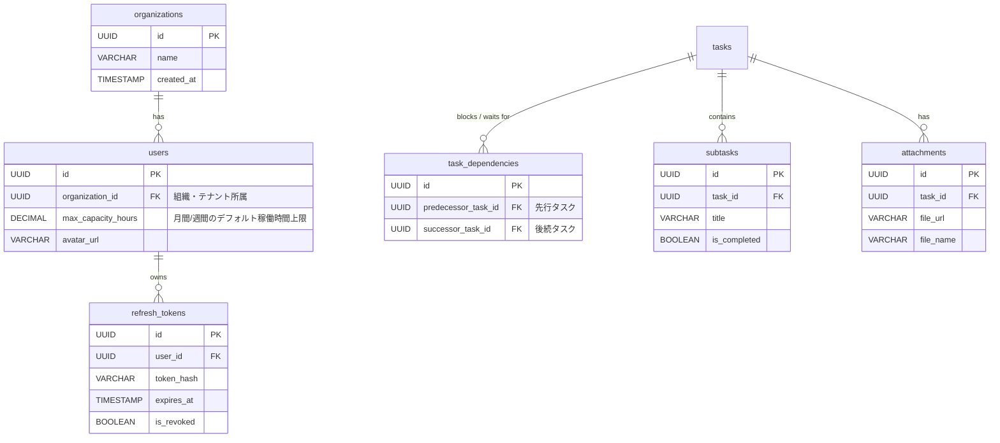

# DevTaskManagementApp: Phase 2 (Post-MVP) 総合設計書

## 1. 開発の背景と目的 (Phase 2)
MVP（フェーズ1）として実装した基礎的なタスク管理・ガントチャート・JWT認証（即時ログアウトGuard）の基盤の上に、**「プロ仕様の実務ツール」** としての高度な機能を追加します。
特に、以下の3点を中核に設計・実装を行います。
1. **堅牢なセキュリティとユーザー連動:** 全APIへのJWT認証追加と、アクションに対するログインユーザー（`req.user.userId`）の自動紐付け。
2. **ロール別ワークフロー:** 管理者(ADMIN)、マネージャー(EM)、開発者(ENGINEER)、ビジネス(BUSINESS)の各視点に最適化された専用ダッシュボードと機能の提供。
3. **プロジェクト管理の高度化:** PostMvpIdeasで策定したサブタスク、依存関係、フォーカスモードなどの全要件の網羅。

※ フェーズ1レビュー対応で実装済みの履歴表示改善（日本語化、起票ログ等）は本設計書から除外しています。

---

## 2. データベース拡張設計 (Phase 2 追加分)

---

## 3. 認証・セキュリティ基盤強化仕様

### 3.1. API 全域の JWT 認証保護
* **バックエンド実装:** `TaskController`, `ProjectController`, `UserController` をはじめとする全エンドポイントへ `@UseGuards(JwtAuthGuard)` を付与し、未認証アクセスを完全に遮断。
* **ユーザーコンテキストの自動注入:** リクエストに含まれる JWT のデコード結果 (`req.user.userId`) を抽出し、以下のデータをバックエンド側で強制的に自動セット（フロントエンドからの送信は無視/不要とする）。
  * タスク作成時の `created_by`
  * タスク更新・削除時の履歴ログ `changed_by`
  * コメント投稿・実績工数 (WorkLogs) 追加時の `user_id`

### 3.2. リフレッシュトークン (Refresh Token) 機構の導入
* `access_token` の有効期限をセキュリティ観点から **15分** に短縮。
* 長寿命（例: 7日間）の `refresh_token` を HttpOnly Cookie で発行し、DBの `refresh_tokens` テーブルでハッシュ化してホワイトリスト管理。
* フロントエンドは Axios インターセプターを実装し、`401 Unauthorized` 検知時に自動で `/api/auth/refresh` APIを呼び出し、再試行する排他制御を行う。

---

## 4. ロール定義とロール別ワークフロー設計

ユーザーの役割（Role）ごとに、直面する課題を最短で解決できる専用の視点（UI/UX）を提供します。
※ 各ロールの詳細なユーザーストーリーと受け入れ基準（Acceptance Criteria）は、[user_stories.md](file:///c:/Users/81904/work_space/dev-task-management-app/docs/user_stories.md) を参照してください。

### 👑 1. ADMINISTRATOR (システム管理者)
* **主なニーズ:** 組織全体のアカウント統制とシステムマスタ管理。
* **専用ワークフロー:** 
  * `/admin/users` におけるアカウント発行、無効化、権限ロール割り当て。
  * **テナント・組織マスタの統制とセキュリティ** (`US-ADM-01` 参照): 組織分離と全域保護の担保。

### 📊 2. ENGINEERING_MANAGER (EM / PM)
* **主なニーズ:** プロジェクト全体の俯瞰、ボトルネックの発見、メンバーの負荷分散。
* **専用ワークフロー:**
  * **インタラクティブ・ガントチャート** (`US-EM-01` 参照): ドラッグ＆ドロップによるリスケジュール、先行/後続（クリティカルパス）の赤線ハイライト表示。
  * **高度なリソースキャパシティ分析** (`US-EM-02` 参照): 期間フィルター（今週/今月）を利用した精緻なアサイン工数算出と、特定日のピーク過負荷（1日8h超え）アラート検知。
  * **見積もり偏差分析** (`US-EM-03` 参照): 見積もり工数に対して実績工数が120%を超過した際の警告ハイライト。

### 💻 3. ENGINEER (開発エンジニア)
* **主なニーズ:** 自分が「今日」何をすべきか明確にし、作業実績の入力を極力減らしたい。
* **専用ワークフロー:**
  * **フォーカスモード (マイ・タスク)** (`US-ENG-01` 参照): 全体ガントを隠し、今日着手すべきタスクだけを表示する専用ダッシュボード。ワンクリックタイマーで `work_logs` に実績を自動記録。
  * **マイ・ガントチャートとセルフキャパシティ分析** (`US-ENG-02` 参照): 自分専用のタイムラインを表示し、安全バッファ（過去の自身の見積もり消化係数に基づいた予測バッファ）を自己確認するセルフチェック機能。

### 📈 4. BUSINESS (ビジネスサイド / PO)
* **主なニーズ:** いつ機能がリリースされるのか、マクロな進捗を知りたい。
* **専用ワークフロー:** 
  * **ロードマップ・ビジネス進捗ビュー** (`US-BUS-01` 参照): 開発の技術的詳細（タスクのサブタスクなど）を隠蔽し、機能群（プロジェクト/エピック）ごとのリリース予測日のみを直感的に表示する。

---

## 5. 高度な機能拡張仕様 (Post-MVP 全項目)

### 5.1. コアタスク管理の高度化
* **サブタスク (チェックリスト):** 1タスク内の細かな作業分割 (`subtasks` テーブル)。
* **タスク依存関係:** ガントチャート連携のため、タスク間の「先行・後続」関係定義 (`task_dependencies` テーブル)。
* **予測完了日の自動算出:** 過去数日間の `work_logs`（実績ペース）から消化速度を逆算し、期日（planned_end_date）に間に合わない場合は事前アラートを発火。

### 5.2. コラボレーション & 外部連携
* **コメント機能 & 添付ファイル:** タスク内チャットとエビデンス画像（S3等のストレージ想定）の保存。
* **チャットツール連携 (Slack / Teams):** Webhook等を用いた、タスク状態変更時（レビュー待ち・完了時）の自動通知機能。

### 5.3. 組織（チーム）マスタ API化
* 現在ハードコードされている `layout.tsx` のヘッダー名や、フロントエンドで持つ `mockCategories` を完全に撤廃し、`GET /api/auth/me` からの `organizationName` 取得および `GET /api/categories` に置き換える。

---

## 6. 🚀 実装ロードマップ（速さと効率を踏まえた順序）

基盤からUIへと積み上げるための、最も手戻りが少なくスピーディな開発順序です。

### 🔹 Step 1: 開発基盤・テストの最適化
* Playwright E2E テストの Global Setup 化 (`storageState.json`) を行い、CIとローカルテストの実行時間を爆速化する。

### 🔹 Step 2: 全域API認証保護とユーザーID連携 (最重要基盤)
* リフレッシュトークン機構 (`refresh_tokens` DB、15分寿命設定) のバックエンド・フロントエンド(Axios)実装。
* 全コントローラーへの `JwtAuthGuard` 適用。
* バックエンド側での `req.user.userId` を用いた作成者・更新者・コメント投稿者の強制バインディング。

### 🔹 Step 3: データモデリングと組織・マスタの完全API化
* `organizations` テーブルの作成、`users` の関連付け。
* ヘッダー組織名の動的化と、カテゴリマスター（`GET /api/categories`）の構築による完全なモック脱却。

### 🔹 Step 4: エンジニア向け「フォーカスモード」実装
* `work_logs`（タイムトラッキング）テーブルとAPIの実装。
* 自分のタスクのみを表示し、タイマー計測できるエンジニア専用ダッシュボードUIの構築。

### 🔹 Step 5: EM向け「リソース・ガント高度化」
* ガントチャートの D&D 対応と依存関係 (`task_dependencies`) ハイライトの実装。
* 期間絞り込みフィルターに基づく、アサイン状況の精緻な負荷（過負荷アラート）算出。

### 🔹 Step 6: ビジネス・プロフェッショナル向け機能の追加
* サブタスク、Slack通知連携、見積もり偏差アラート、予測バッファの算出アルゴリズムなどの高度な機能拡充。
